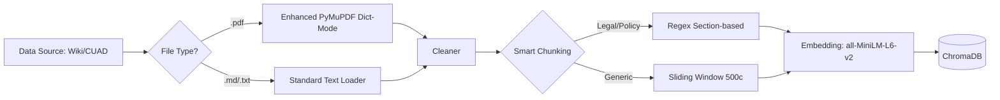
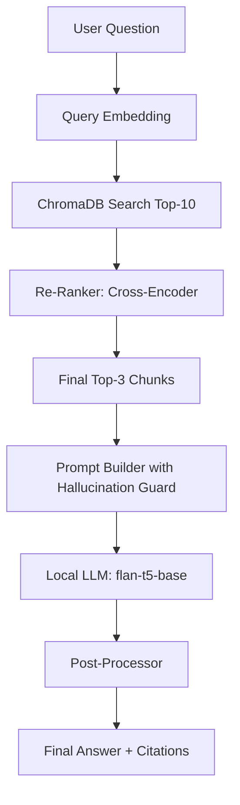

# 🏛️ Architecture: RAG Document Q&A Bot

This document outlines the end-to-end data flow and model choices for the RAG Bot.

---

## 🏗️ System Flow

The system follows a staggered pipeline for both ingestion and retrieval.

### **1. Ingestion Pipeline**

### **2. Retrieval & Generation Pipeline**

---

## 🧠 Model Selection

| Model | Purpose | Version | Reasoning |
| :--- | :--- | :--- | :--- |
| **all-MiniLM-L6-v2** | Bi-Encoder (Embeddings) | Sentence-Transformers | Fast, lightweight, and great for initial semantic search candidates. |
| **ms-marco-MiniLM-L-6-v2** | Cross-Encoder (Re-Ranker) | Sentence-Transformers | High precision for passage ranking. Corrects "false positive" semantic matches. |
| **FLAN-T5-Base** | Sequence-to-Sequence (LLM) | Google | Excellent zero-shot performance for reading comprehension. Efficient on CPU. |

---

## 🛡️ Precision & Hallucination Guard

- **Sigmoid-based Re-ranking**: We normalize re-ranker logits to a `0-1` scale to maintain consistent confidence scoring (`High`, `Medium`, `Low`).
- **Legal Prompting**: Contracts trigger a specialized prompt ensuring the LLM identifies conflicting terms and avoids unstated obligations.
- **Strict Grounding**: The system is hard-coded to return the standard "Not found" message if the model outputs "I don't know" or if no chunks pass the re-ranking threshold.

---

## ⚙️ Engineering Decisions

- **Local Execution**: All models run locally in the Python environment, ensuring 100% data privacy (no third-party AI APIs).
- **CPU Optimized**: Uses explicitly quantized-ready models (Small) to ensure the system runs on standard developer hardware without requiring a GPU.
- **Sliding Window Chunking**: Ensures that even if important information falls on a chunk boundary, the overlapping context preserves the meaning.
