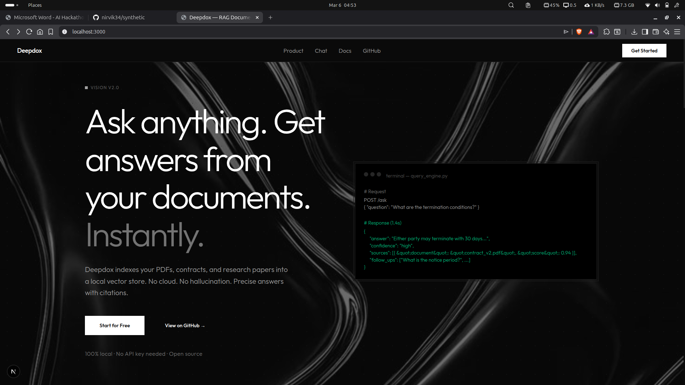
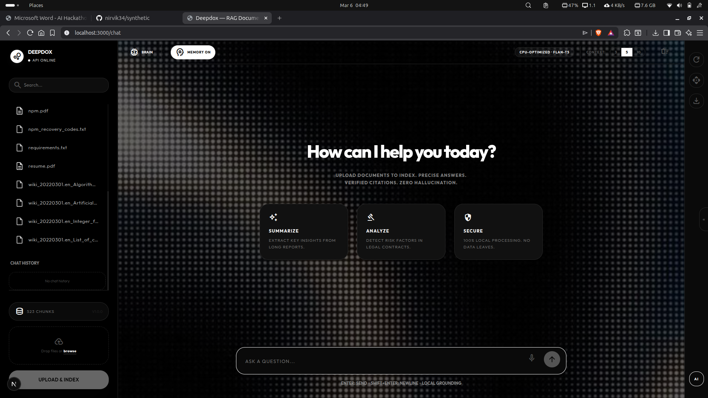
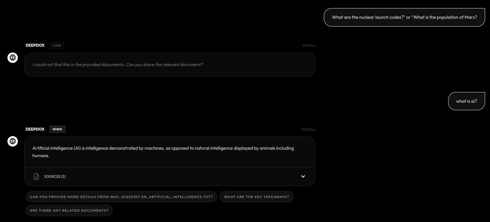
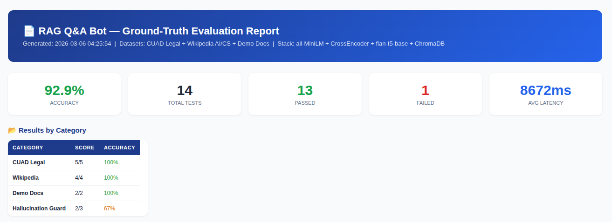

# Deepdox — Local RAG Document Q&A System

A production-ready **Retrieval-Augmented Generation (RAG)** system that answers questions from your documents using only local models — no API keys, no internet, no data leaks. Built with FastAPI, ChromaDB, Sentence-Transformers, and a Next.js chat frontend.

---

## Table of Contents

- [Features](#features)
- [Gallery](#gallery)
- [Tech Stack](#tech-stack)
- [System Requirements](#system-requirements)
- [Installation](#installation)
- [Running the System](#running-the-system)
- [API Endpoints](#api-endpoints)
- [How the Model Responds](#how-the-model-responds)
- [Configuration](#configuration)
- [Datasets](#datasets)
- [Project Structure](#project-structure)
- [Docker](#docker)
- [Benchmarking](#benchmarking)

---

## Features

- **Fully local** — all models run on CPU, no GPU required
- **Two-stage retrieval** — Bi-Encoder for recall + Cross-Encoder for precision
- **Hallucination guard** — multi-layer system that blocks fabricated answers
- **Legal-aware prompting** — auto-detects CUAD contracts and switches persona
- **Smart chunking** — regex-based section splitting for legal docs, sliding window for general text
- **Multi-turn memory** — last 3 Q&A turns fed back into every prompt
- **Inline citations** — answers reference sources as `[1]`, `[2]` with document + snippet + score
- **Follow-up suggestions** — model generates 3 contextual follow-up questions per answer
- **File upload API** — drop new documents in via `POST /upload-file` and re-ingest
- **PDF support** — dict-mode PyMuPDF extraction preserves block/line structure
- **Metadata-aware retrieval** — mention a filename in your query to scope search to that document

---

## Gallery

### 1. Premium Landing Page

*High-end, dark-mode landing page featuring the new Deepdox branding and responsive features section.*

### 2. Conversational Intelligence

*Advanced chat interface with multi-turn memory and real-time status indicators.*

### 3. Verifiable Citations & Hallucination Guard

*Proof of grounding: The system provides detailed citations [1] for valid answers and triggers the strict Hallucination Guard for out-of-bounds queries.*

### 4. Benchmarked Accuracy

*Scientific verification: 92.9% overall accuracy across CUAD Legal and Wikipedia datasets.*

---

## Tech Stack

| Component | Technology | Version |
|---|---|---|
| API Framework | FastAPI + Uvicorn | 0.111.0 / 0.29.0 |
| Vector Store | ChromaDB (persistent, local) | 0.5.0 |
| Embedding Model | `sentence-transformers/all-MiniLM-L6-v2` | — |
| Re-Ranker | `cross-encoder/ms-marco-MiniLM-L-6-v2` | — |
| Language Model | `google/flan-t5-base` | — |
| PDF Parsing | PyMuPDF (fitz) | 1.24.3 |
| Frontend | Next.js 14 + Tailwind CSS | — |
| Data Validation | Pydantic v2 | 2.7.1 |
| Logging | Loguru | 0.7.2 |

---

## System Requirements

- Python 3.10+
- Node.js 18+ (for the frontend only)
- ~2 GB disk space for model weights (downloaded automatically on first run)
- 4 GB RAM minimum (8 GB recommended)
- No GPU required

---

## Installation

### Backend

```bash
# Clone the repo
git clone https://github.com/nirvik34/synthetic.git
cd synthetic

# Create and activate virtual environment
python -m venv venv
source venv/bin/activate          # Windows: venv\Scripts\activate

# Install dependencies
pip install -r requirements.txt
```

### Frontend

```bash
cd frontend
npm install
```

---

## Running the System

### Step 1 — (Optional) Import datasets

```bash
# Import 5 CUAD legal contracts
python scripts/import_dataset.py --source cuad --limit 5

# Import Wikipedia articles on a topic
python scripts/import_dataset.py --source wiki_2020 --topic "Artificial Intelligence" --limit 2
```

### Step 2 — Start the API server

```bash
uvicorn app.main:app --port 8000 --reload
```

The server starts at `http://localhost:8000`. On first boot it will:
1. Pre-load the embedding model (`all-MiniLM-L6-v2`)
2. Pre-load the LLM pipeline (`flan-t5-base`)
3. Attempt to load an existing ChromaDB vector store (if available)

### Step 3 — Index your documents

```bash
curl -X POST http://localhost:8000/ingest
```

> Place `.txt`, `.md`, or `.pdf` files in the `docs/` folder before ingesting.

### Step 4 — Ask questions

```bash
curl -X POST http://localhost:8000/ask \
  -H "Content-Type: application/json" \
  -d '{"question": "What are the termination clauses in the contract?"}'
```

### Step 5 — Start the chat UI

```bash
cd frontend
npm run dev
# Open http://localhost:3000
```

---

## API Endpoints

| Method | Endpoint | Description |
|---|---|---|
| `GET` | `/health` | System health — vector store status, chunk count, model status |
| `POST` | `/ingest` | Index all documents in `docs/` into ChromaDB |
| `POST` | `/upload-file` | Upload a single `.txt`, `.md`, or `.pdf` file to `docs/` |
| `POST` | `/ask` | Ask a question, get a grounded answer with sources |
| `GET` | `/documents` | List all unique document names currently indexed |
| `GET` | `/document/{filename}` | Return the raw text content of a specific document |

### POST `/ask` — Request Body

```json
{
  "question": "What is the indemnification clause?",
  "top_k": 5,
  "context": [
    {
      "question": "Who are the parties?",
      "answer": "The agreement is between Company A and Company B."
    }
  ]
}
```

### POST `/ask` — Response Body

```json
{
  "answer": "The indemnification clause requires Party A to defend Party B against... [1]",
  "confidence": "high",
  "question": "What is the indemnification clause?",
  "sources": [
    {
      "document": "cuad_contract_0.txt",
      "snippet": "Party A shall indemnify and hold harmless Party B...",
      "score": 0.7823
    }
  ],
  "follow_ups": [
    "Are there any liability caps mentioned?",
    "What is the governing law for this agreement?",
    "What are the key obligations in cuad_contract_0.txt?"
  ]
}
```

---

## How the Model Responds

Every question goes through a strict **5-layer pipeline**. Here is exactly what happens:

### Layer 1 — Bi-Encoder Retrieval (`app/retrieval.py`)

The question is embedded with `all-MiniLM-L6-v2` and used to query ChromaDB (cosine similarity). The system fetches **top-20 candidate chunks** (`top_k * 2`, min 10).

**Metadata filter:** If you mention a document name in your question (e.g., "in the company_policies file"), the system scopes the ChromaDB query to only chunks from that document using a `where` filter.

### Layer 2 — Cross-Encoder Re-Ranking (`app/embeddings.py` + `app/retrieval.py`)

Every candidate is scored by `ms-marco-MiniLM-L-6-v2` (a Cross-Encoder). Logits are converted to probabilities via sigmoid. The final score is a **50/50 hybrid**:

```
final_score = 0.5 × bi-encoder_score + 0.5 × cross-encoder_score
```

If all cross-encoder scores are near-zero (`< 0.01`), the system automatically falls back to pure bi-encoder scores to avoid destroying valid matches.

Chunks are re-sorted by final score and the **top-K** are passed forward.

**Confidence scoring** (`compute_confidence`):

| Confidence | Condition |
|---|---|
| `high` | max_score ≥ 0.50 AND avg_score ≥ 0.25 |
| `medium` | max_score ≥ 0.30 AND avg_score ≥ 0.12 |
| `low` | anything below the above |

### Layer 3 — Prompt Construction (`app/generation.py` — `build_prompt`)

The top-3 chunks are assembled into a prompt (capped at **2000 characters** of context). The prompt adapts based on document type:

**If legal document** (`cuad`, `contract`, `agreement` in filename):
> *"You are a professional legal assistant. Answer the user's question comprehensively using ONLY the provided legal context... reference source numbers like [1], [2]..."*

**If general document:**
> *"You are a helpful and informative assistant. Answer the question thoroughly using ONLY the provided context... Reference source numbers like [1], [2]..."*

The **last 3 conversation turns** are prepended as history for multi-turn support.

### Layer 4 — LLM Generation (`app/generation.py` — `generate_answer`)

`flan-t5-base` runs `text2text-generation` with:
- `max_new_tokens=256`
- `temperature=0.3`
- `top_p=0.9`
- `repetition_penalty=1.2`

**Post-generation quality checks:**
- If output is empty → fallback
- If output is `"i don't know"` or `"not in context"` → fallback
- If output is just a bare citation like `[2]` → extract and return the raw snippet from that chunk

**Fallback when LLM says "unknown" but chunks exist:**
> *"I couldn't synthesize a full answer, but here is what I found in `{document}`: ...{first 400 chars of top chunk}..."*

### Layer 5 — Hallucination Guard (`app/main.py` — `POST /ask`)

Even after generation, a final multi-check runs before the answer is returned:

1. **No results check** — if `retrieve()` returned zero chunks, block immediately
2. **NOT_FOUND_RESPONSE check** — if the LLM itself returned the not-found string, confirm as blocked
3. **"could not find" string check** — catches soft not-found phrasings from the LLM
4. **Content-overlap check** — strips stopwords from the query, checks if ≥20% of the key terms appear in retrieved snippets. If overlap is below threshold, the answer is blocked as a false positive

If any check fires, the final response is:

> **"I could not find this in the provided documents. Can you share the relevant document?"**

...and `confidence` is forced to `"low"`, `sources` is cleared to `[]`, and no follow-up questions are generated.

### Summary Flow

```
Question
  │
  ├─ [Bi-Encoder] all-MiniLM-L6-v2
  │    └─ ChromaDB cosine search → top-20 candidates
  │
  ├─ [Cross-Encoder Re-Ranker] ms-marco-MiniLM-L-6-v2
  │    └─ Sigmoid-normalized hybrid score → top-K chunks
  │    └─ Confidence: high / medium / low
  │
  ├─ [Prompt Builder]
  │    └─ Legal vs general persona detection
  │    └─ Up to 2000 chars context + last 3 conversation turns
  │    └─ Citation enforcement: "[1]", "[2]"
  │
  ├─ [LLM] google/flan-t5-base (CPU)
  │    └─ Generates full-sentence answer
  │    └─ Post: checks for empty / "I don't know" / bare citation
  │    └─ Fallback: raw snippet if LLM fails to synthesize
  │
  └─ [Hallucination Guard]
       └─ Content-overlap check (20% key-term threshold)
       └─ If blocked → NOT_FOUND_RESPONSE, confidence=low, sources=[]
       └─ If passed → generate 3 follow-up suggestions
```

---

## Configuration

All defaults can be overridden via environment variables (or a `.env` file):

| Variable | Default | Description |
|---|---|---|
| `LLM_MODEL_NAME` | `google/flan-t5-base` | HuggingFace model for generation |
| `EMBEDDING_MODEL_NAME` | `all-MiniLM-L6-v2` | Sentence-Transformers bi-encoder |
| `TOP_K` | `10` | Number of final chunks to pass to LLM |
| `SIMILARITY_THRESHOLD` | `0.15` | Minimum cosine score to keep a candidate |
| `DOCS_DIR` | `docs` | Folder scanned by `/ingest` |
| `CHROMA_DB_DIR` | `chroma_db` | Persistent ChromaDB path |
| `CHUNK_SIZE` | `500` | Characters per chunk (general docs) |
| `CHUNK_OVERLAP` | `50` | Overlap between adjacent chunks |
| `USE_GPU` | `false` | Set `true` to use CUDA for LLM |

---

## Datasets

### CUAD — Legal Contracts

The **Contract Understanding Atticus Dataset** contains 500+ legal contracts with expert annotations. This system uses 5 contracts by default. Import:

```bash
python scripts/import_dataset.py --source cuad --limit 5
```

### Wikipedia 2020/2022

Streaming dumps of Wikipedia articles. Import by topic:

```bash
python scripts/import_dataset.py --source wiki_2020 --topic "Deep Learning" --limit 2
python scripts/import_dataset.py --source wiki_2022 --topic "Algorithm" --limit 3
```

Pre-downloaded articles are already in `docs/` (see `wiki_20220301.en_*.txt`).

---

## Project Structure

```
deepdox/
├── app/
│   ├── main.py          ← FastAPI app, all API endpoints, hallucination guard
│   ├── ingestion.py     ← File loading, text cleaning, chunking (legal + standard)
│   ├── embeddings.py    ← Bi-encoder, cross-encoder, ChromaDB (load/build)
│   ├── retrieval.py     ← Query embedding, ChromaDB search, re-ranking, confidence
│   ├── generation.py    ← Prompt building, flan-t5 generation, follow-ups
│   └── models.py        ← Pydantic request/response schemas
├── docs/                ← Source documents (.txt, .md, .pdf)
├── scripts/
│   ├── import_dataset.py    ← HuggingFace streaming dataset importer
│   ├── evaluate_local.py    ← Accuracy benchmark against local CUAD data
│   ├── evaluate_cuad.py     ← Full CUAD benchmark
│   └── pre_download_models.py ← Pre-bake model weights for Docker
├── frontend/            ← Next.js 14 chat interface
├── tests/               ← API and unit tests
├── Dockerfile
├── requirements.txt
└── ARCHITECTURE.md
```

---

## Docker

```bash
# Build (pre-downloads models during build for instant startup)
docker build -t synthetic-rag .

# Run
docker run -p 8000:8000 synthetic-rag
```

---

## Benchmarking

```bash
# Evaluate answer quality against CUAD ground truth
python scripts/evaluate_local.py

# Full CUAD benchmark
python scripts/evaluate_cuad.py
```